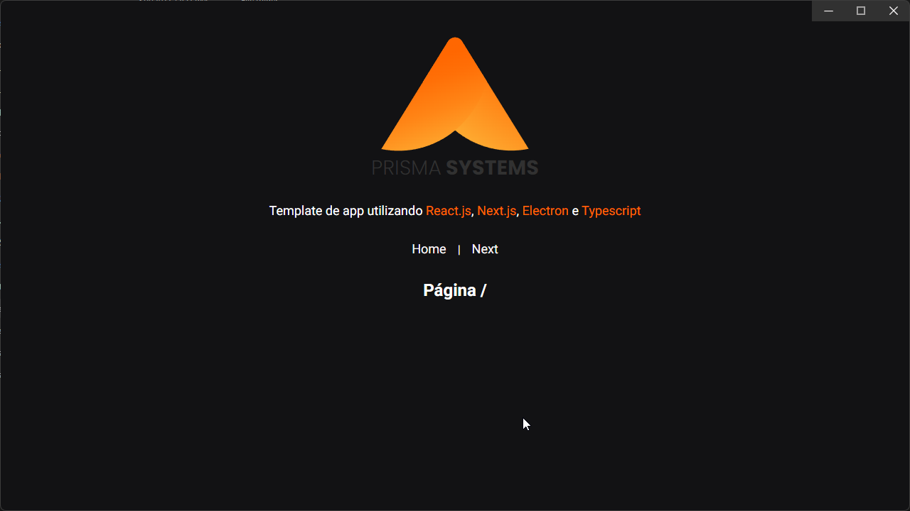

## Template para produção de app com Electron, ReactJS e NextJS

</br><div align="center">


</div>

### Instruções de uso

Clone o projeto e acesse a pasta do mesmo.

```bash
$ git clone https://github.com/adairjuneoaf/template-app-react-next-electron
$ cd template-app-react-next-electron
```

Para iniciá-lo, siga os passos abaixo:

```bash
# Instalar as dependências.
$ yarn
# Iniciar o projeto.
$ yarn dev
# Iniciar o processo de ciração de uma Build do projeto.
$ yarn build

```

O app estará disponível assim que a tela estiveer pronta para ser exibida, basta aguardar e um aplicativo irá abrir em seu desktop.
